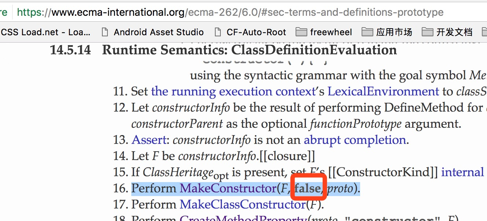
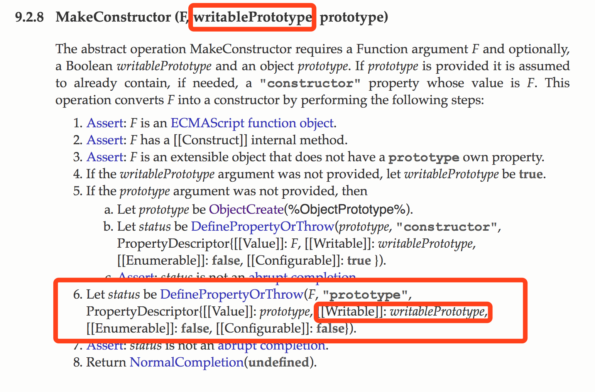

<h1>ES6中class的prototype引用不可修改<sub>2017-07-27</sub></h1>

今天在一个前端微信群里有人提出了这样一个问题：

```js
class A {
  say() {
    console.log('i am a');
  }
}

// 直接覆盖A.prototype无效
A.prototype = {
  say() {
    console.log('i am b');
  }
};

let a  = new A();
a.say();
// => i am a
```

通过`ES6`的`class`创建一个类，然后修改其`prototype`的引用是无效的。如果用`ES5`的方式，则可以随意修改：

```js
function A1() {}
A1.prototype = {
  say: function() {
    console.log('i am a1');
  }
};
A1.prototype = {
  say: function() {
    console.log('i am b1');
  }
};
var a1  = new A1();
a1.say();
// => i am b1
```

可见`ES6`中`class`的实现跟`function`相比在这一点上是截然不同的

从表现上来看，通过`class`声明的类的`prototype`是“不可写”的，我们知道`Object.defineProperty`方法可以设置对象的某个属性是否可写，例如：

```js
let obj = {};
Object.defineProperty(obj, 'prop1', {
  value: 1, // 属性值
  writable: false // 是否可写
});
console.log(obj.prop1); // => 1
obj.prop1 = 2;
console.log(obj.prop1); // => 1 
```

可以看到这样定义(`writable: false`)的`obj.prop1`对其赋值是无效的

那么如何判断一个对象的某个属性是不是可写呢？很简单：

```js
class AnotherA {
  say() {
    console.log('i am another a');
  }
}
let prototypeDescriptor = Object.getOwnPropertyDescriptor(AnotherA, 'prototype');
console.log(prototypeDescriptor);
// => {value: Object, writable: false, enumerable: false, configurable: false}
```

可以看到`class`声明的类的`prototype`的`writable`是`false`，所以对其`prototype`再次赋值是无效的，当然可以通过`AnotherA.prototype.say = ...`对其成员进行修改

经过查阅`ECMA2015`规范也证实了这一点：



上图是`ES6`中关于`class`的定义方案，在第16步中，调用`MakeConstructor`方法，注意第二个参数为`false`，然后再看下`MakeConstructor`这个方法：



可以看到，正是第二个参数决定了`prototype`是否可写

有兴趣的朋友可以再查一下`function`在这一步是怎么实现的，你会发现同样也调用了`MakeConstructor`方法，但是第二个参数是`true`

参考资料： 
- ES6 ClassDefinitionEvaluation - <https://www.ecma-international.org/ecma-262/6.0/#sec-runtime-semantics-classdefinitionevaluation>
- ES6 MakeConstructor - <https://www.ecma-international.org/ecma-262/6.0/#sec-makeconstructor>
- Object.defineProperty - <https://developer.mozilla.org/en-US/docs/Web/JavaScript/Reference/Global_Objects/Object/defineProperty>
- Object.getOwnPropertyDescriptor - <https://developer.mozilla.org/en-US/docs/Web/JavaScript/Reference/Global_Objects/Object/getOwnPropertyDescriptor>

<br/>
    
___EOF___

<br/>